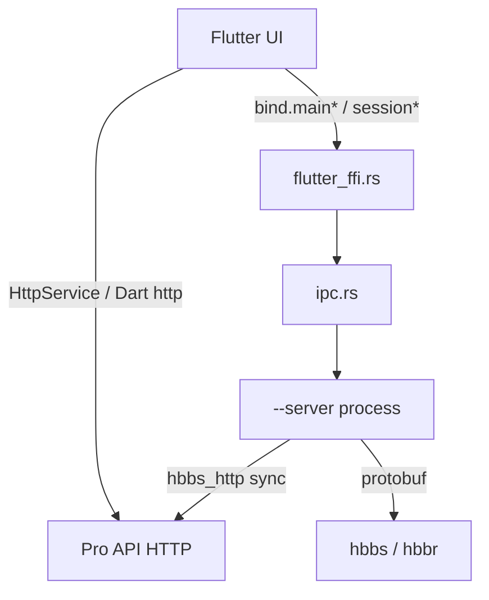

# API klienta desktop (BetterDesk / RustDesk)

Dokument opisuje **warstwy API, którymi posługuje się klient desktop** (Windows / Linux): outbound HTTP do Pro/API, Flutter↔Rust FFI oraz IPC między procesami.

Zakres: powierzchnia programowa UI↔native↔service oraz wywołania `/api/*`.  
Poza zakresem: protokół video/audio po `LoginRequest`, instalacja `rustdesk-server`, pełne schematy JSON API Pro (serwer).

Koordynacja sesji (hbbs / hbbr / P2P / LAN): [CONNECTIVITY.md](CONNECTIVITY.md).  
Build i codegen bridge: [BUILD_DESKTOP.md](BUILD_DESKTOP.md).

---

## 1. Model ogólny

Klient **nie wystawia lokalnego REST** dla zewnętrznych narzędzi. „API klienta” to trzy osobne kanały:

| Warstwa | Protokół | Kierunek | Rola |
|---------|----------|----------|------|
| **HTTP Pro / self-hosted** | HTTPS/HTTP `/api/*` | klient → zdalny API | konto, AB, grupy, heartbeat, deploy, audit |
| **FFI** | `flutter_rust_bridge` | in-process Flutter ↔ Rust | opcje, sesje, service, eventy |
| **IPC** | named pipe / Unix socket | UI ↔ `--server` ↔ `--cm` / tray | config, status, sesje przychodzące |

Media sesji (ekran, wejście, pliki) **nie** idą przez HTTP API — tylko P2P / relay / direct (patrz CONNECTIVITY).



---

## 2. Non-goals (dla agentów)

- **Brak** lokalnego serwera HTTP/REST do sterowania klientem z zewnątrz.
- Rendezvous (hbbs) to **protobuf**, nie REST — nie mylić z `/api/*`.
- Publiczny cloud (`*.rustdesk.com`) **wyłącza** background heartbeat / sysinfo / audit sync (`is_public`).
- `flutter/lib/generated_bridge.dart` jest **generowany** — nie edytować ręcznie.
- Mobile / web: ten sam stack częściowo istnieje, ale aktywny zakres BetterDesk to desktop Win/Linux.

---

## 3. Model procesów

Wejście: [`src/core_main.rs`](../src/core_main.rs).

| Flaga / proces | Rola względem API |
|----------------|-------------------|
| UI (Flutter, bez flagi serwisowej) | FFI + często bezpośredni HTTP do Pro API |
| `--server` | Główny IPC server (postfix `""`), rendezvous mediator, `hbbs_http::sync` |
| `--cm` | Connection Manager — słucha IPC `_cm` |
| `--tray` | Tray; na Windows komunikacja IPC ze service |
| `--portable-service` | Windows: podniesiony helper capture/input — IPC `_portable_service` |
| `--service` | Ścieżka instalacji / OS service (platformowa) |

Flutter UI **nie jest** `--server`. Mutacje opcji idą:

```
Flutter bind.mainSetOption(key, val)
  → ui_interface::set_option (cache OPTIONS)
  → ipc::set_options → Data::Options
  → --server stosuje Config::set_options
```

Źródło prawdy dla opcji serwisowych na desktopie: proces **`--server`**. UI trzyma cache i synchronizuje przez IPC.

---

## 4. Outbound HTTP (`/api/*`)

### 4.1. Rozdzielczość URL

[`get_api_server()`](../src/common.rs) / [`ui_interface::get_api_server`](../src/ui_interface.rs):

1. Licencja Windows (`lic.api` w nazwie exe), jeśli obecna  
2. Opcja `api-server`  
3. Z `custom-rendezvous-server`: host z portem **−2** (21114) jako `http://…`  
4. Domyślnie **pusty string** (BetterDesk nie używa `admin.rustdesk.com`)

`is_public(url)` — host `rustdesk.com` lub `*.rustdesk.com`. Gdy `true`, sync w `hbbs_http::sync` **nie** woła heartbeat/sysinfo; audit też jest gated.

FFI: `main_get_api_server()` → ten sam URL dla Flutter.

### 4.2. Klient HTTP

| Ścieżka | Plik | Uwagi |
|---------|------|--------|
| Rust (sync / OIDC / record) | [`src/hbbs_http/http_client.rs`](../src/hbbs_http/http_client.rs) | reqwest, SOCKS5, TLS |
| Flutter | [`flutter/lib/utils/http_service.dart`](../flutter/lib/utils/http_service.dart) | Dart `http` **albo** Rust `mainHttpRequest` |
| Generyczny async z UI | `ui_interface::http_request` → mapa `ASYNC_HTTP_STATUS` | Flutter polluje `main_get_http_status` |

Reguła `HttpService` (desktop):

- Użyj **Dart http**, gdy brak proxy **i** wyłączone `enable-flutter-http-on-rust`.  
- W przeciwnym razie (proxy lub flaga) → **Rust** `mainHttpRequest` + polling statusu.

Auth konta / AB: zwykle `Authorization: Bearer {access_token}` z `LocalConfig`.

### 4.3. Endpointy — Rust (background / native)

| Endpoint | Moduł | Auth / gating | Cel |
|----------|-------|---------------|-----|
| `/api/heartbeat` | [`src/hbbs_http/sync.rs`](../src/hbbs_http/sync.rs) | pomijany gdy pusty URL lub `is_public` | heartbeat + tożsamość SKU; odpowiedź: `strategy`, `disconnect`, `modified_at`, … |
| `/api/sysinfo`, `/api/sysinfo_ver` | `sync.rs` | jak wyżej | rejestracja urządzenia / Pro (+ `product_sku` / `conn_mode`) |
| `/api/switch-grant` | `sync.rs` | jak wyżej | autoryzacja switch-sides (podpis) |
| `/api/login-options` | [`account.rs`](../src/hbbs_http/account.rs), [`record_upload.rs`](../src/hbbs_http/record_upload.rs) | discovery metod logowania | OIDC / record |
| `/api/oidc/auth`, `/api/oidc/auth-query` | `account.rs` | flow OIDC | konto |
| `/api/record` | `record_upload.rs` | upload nagrań | Pro |
| `/api/devices/deploy` | [`ui_interface.rs`](../src/ui_interface.rs) | token deploy | wdrożenie urządzenia |
| `/api/devices/cli` | [`core_main.rs`](../src/core_main.rs) | CLI deploy | helper |
| `/api/devices/register` | [`betterdesk.rs`](../src/hbbs_http/betterdesk.rs) | jak heartbeat gating | enrollment + `product_sku` / `conn_mode` / `tags` |
| `/api/audit/{type}` | [`common.rs`](../src/common.rs) `get_audit_server` | tylko nie-public | audit POST |
| `/api/branding` | [`betterdesk.rs`](../src/hbbs_http/betterdesk.rs) | publiczne (GET), bez loginu | Client Branding sync → LocalConfig `branding-*` (oba SKU) |

### 4.3.1. Dualizm SKU — pola tożsamości (kontrakt panelu)

Źródło: [`betterdesk::device_identity_fields`](../src/hbbs_http/betterdesk.rs) / `merge_device_identity`. Wysyłane w **register**, **sysinfo** i **heartbeat**.

| Pole | Wartości | Znaczenie |
|------|----------|-----------|
| `device_type` / `client` / `client_product` | `betterdesk-desktop` | Legacy marker (nie używać do rozróżnienia Support) |
| `product_sku` | `betterdesk-desktop` \| `betterdesk-support` | SKU Generatora; Support gdy bake-in `conn-type: incoming` |
| `conn_mode` | `normal` \| `incoming-only` | Tryb zastosowany lokalnie (`HARD_SETTINGS`) |
| `app_name` | string | Nazwa z bake-in / APP_NAME |
| `tags` (register) | `betterdesk-desktop` albo `betterdesk-support,incoming-only` | Kompatybilne tagi enrollment |
| `enrollment_status` | opcjonalnie | Lokalny status enroll |
| `branding_revision` / `branding_source` | opcjonalnie | Sync brandingu do device details |

**Panel:** zapisz te pola przy heartbeat/sysinfo/register i pokaż w szczegółach urządzenia. Support Agent (`product_sku=betterdesk-support`) nie może być „przełączony” na full przez strategy — klient ignoruje fixed/lockdown opcje; serwer nie powinien takich wysyłać.

Szczegóły produktowe: [OFFICIAL_CLIENT.md](OFFICIAL_CLIENT.md) (sekcja Dualizm SKU).

### 4.4. Endpointy — Flutter (konto / AB / grupy)

Base: `await bind.mainGetApiServer()`. DTO / typy: [`flutter/lib/common/hbbs/hbbs.dart`](../flutter/lib/common/hbbs/hbbs.dart).

| Endpoint | Plik |
|----------|------|
| `/api/login`, `/api/logout`, `/api/currentUser`, `/api/login-options` | [`user_model.dart`](../flutter/lib/models/user_model.dart) |
| `/api/ab`, `/api/ab/settings`, `/api/ab/personal`, `/api/ab/shared/profiles`, `/api/ab/peers`, `/api/ab/tags/…`, `/api/ab/peer/…`, `/api/ab/tag/…` | [`ab_model.dart`](../flutter/lib/models/ab_model.dart) |
| `/api/users`, `/api/peers`, `/api/device-group/accessible` | [`group_model.dart`](../flutter/lib/models/group_model.dart) |
| `/api/audit` | [`dialog.dart`](../flutter/lib/common/widgets/dialog.dart) (wybrane UI) |

Legacy Sciter (`src/ui/*.tis`) używa tych samych ścieżek — deprecated, nie rozwijać.

---

## 5. FFI (Flutter ↔ Rust)

### 5.1. Pliki

| Rola | Ścieżka |
|------|---------|
| Definicje eksportów | [`src/flutter_ffi.rs`](../src/flutter_ffi.rs) |
| Sesje / eventy / texture | [`src/flutter.rs`](../src/flutter.rs) |
| Wspólna logika UI | [`src/ui_interface.rs`](../src/ui_interface.rs) |
| CM bridge | [`src/ui_cm_interface.rs`](../src/ui_cm_interface.rs) |
| Wygenerowany Dart | `flutter/lib/generated_bridge.dart` (**codegen**) |
| Load DLL/SO | [`flutter/lib/models/native_model.dart`](../flutter/lib/models/native_model.dart) |
| Globalny accessor | [`platform_model.dart`](../flutter/lib/models/platform_model.dart) → `bind` |
| Maszyna stanu sesji UI | [`flutter/lib/models/model.dart`](../flutter/lib/models/model.dart) |

Codegen: `flutter_rust_bridge_codegen` **1.80.1** (patrz BUILD_DESKTOP / CI `bridge.yml`). Po zmianie sygnatur w `flutter_ffi.rs` trzeba przebudować bridge.

### 5.2. Semantyka wywołań

| Typ | Przykład | Zachowanie |
|-----|----------|------------|
| Sync | `main_get_option_sync`, `SyncReturn<T>` | natychmiastowa wartość |
| Async fire-and-forget / poll | `main_http_request` + `main_get_http_status` | wynik w mapie statusów |
| Stream globalny | `start_global_event_stream(sink, app_type)` | JSON eventy do Flutter |
| Stream sesji | `session_start` → `EventToUI` | `Event` (JSON), `Rgba`, `Texture` |

`initialize` / `main_init(app_dir, custom_client_config)` — boot: logi, custom client, test NAT.

### 5.3. Grupy domenowe (nie pełny katalog)

Agenci: szukaj symboli w `flutter_ffi.rs` po prefiksie; poniżej mapa domen.

**Config / opcje / serwery**

- `main_get_option` / `main_set_option` / `main_get_options` / `main_set_options`
- `main_get_local_option` / `main_set_local_option`
- `main_get_api_server`, `main_is_using_public_server`
- `main_test_if_valid_server`, `main_set_socks` / `main_get_socks`
- `main_is_option_fixed`

**Service / status**

- `main_start_service` / `main_stop_service`
- `main_check_connect_status` / `main_get_connect_status`
- `main_get_my_id`, `main_get_uuid`, `main_change_id`

**Account / HTTP / deploy**

- `main_account_auth` / `main_account_auth_cancel` / `main_account_auth_result`
- `main_http_request` / `main_get_http_status`
- `main_deploy_device`, `main_resolve_avatar_url`

**Peers / AB cache lokalny**

- `main_load_recent_peers`, `main_load_fav_peers`, `main_load_lan_peers`
- `main_get_peer_*`, `main_set_peer_*`, `main_remove_peer`
- `main_save_ab` / `main_load_ab`, `main_save_group` / `main_load_group`

**Sesja wychodząca** (`session_*`)

- Lifecycle: `session_add_sync`, `session_start`, `session_close`, `session_reconnect`, `session_login`, `session_send2fa`
- Widok: quality, displays, privacy mode, screenshot, record
- Input: `session_handle_flutter_key_event`, `session_input_*`, mouse via inne ścieżki
- FS: `session_read_remote_dir`, `session_send_files`, …
- Terminal: `session_open_terminal`, `session_send_terminal_input`, …

**Platform / misc**

- Linux: `main_start_dbus_server` (deep link)
- Displays, hwcodec, theme/lang, passwords, fingerprint

---

## 6. IPC

### 6.1. Transport

Implementacja: [`src/ipc.rs`](../src/ipc.rs) (`parity_tokio_ipc`, serde tagged `Data { t, c }`).

Ścieżki: [`Config::ipc_path`](../libs/hbb_common/src/config.rs) / `ipc_path_for_uid`.

| OS | Forma |
|----|--------|
| Windows | `\\.\pipe\{AppName}\query{postfix}` |
| Linux / macOS | Unix socket w katalogu scoped po UID |

### 6.2. Postfixy

| Postfix | Stała / użycie | Cel |
|---------|----------------|-----|
| `""` (pusty) | default | UI ↔ `--server`: opcje, config, NAT, rendezvous, status |
| `_service` | `POSTFIX_SERVICE` w [`common.rs`](../src/common.rs) | chroniony kanał service (Linux root↔user); allowlist m.in. `SyncConfig` |
| `_cm` | Connection Manager | sesje przychodzące, uprawnienia, chat |
| `_portable_service` | Windows portable | elevated capture/input |
| `_url` | macOS / deep link | URL scheme → event do Flutter |
| `_uinput_keyboard` / `_uinput_mouse` / `_uinput_control` | Linux | injekcja uinput |
| `_pa` | PulseAudio (legacy) | lokalny audio |

Auth peera: [`src/ipc/auth.rs`](../src/ipc/auth.rs) (UID/exe na Linux; tokeny portable/service na Windows).

### 6.3. Ważne warianty `Data`

Reprezentatywne (pełny enum w `ipc.rs`):

- Sesja CM: `Login { … }`, `Authorize`, `Close`, `ChatMessage`, `SwitchPermission`
- Config: `Config((name, value))`, `Options(HashMap)`, `SyncConfig`, `Socks`, `NatType`
- Status: `OnlineStatus`, `VideoConnCount`, `SystemInfo`, `MouseMoveTime`
- Sesja / specjalne: `FS(...)`, `SwitchSidesRequest`, `RawMessage`, `Deployed`, `DataPortableService(...)`

### 6.4. Typowe flow

**Get rendezvous z procesu UI**

```
common::get_rendezvous_server()
  → ipc::get_rendezvous_server(timeout)
  → Data::Config("rendezvous_server", None)
  → odpowiedź z aktywnym serwerem
```

**Incoming session → CM**

```
server/connection.rs → ipc::connect("_cm") → Data::Login { … }
ui_cm_interface.rs nasłuchuje "_cm" → Flutter CM UI
```

**Status loop UI**

`ui_interface::check_connect_status_` utrzymuje IPC i pcha opcje / czasy / liczbę połączeń video do UI.

Przykład / harness: [`examples/ipc.rs`](../examples/ipc.rs).

---

## 7. Klucze config związane z API

Definicje: [`libs/hbb_common/src/config.rs`](../libs/hbb_common/src/config.rs) (`keys::OPTION_*`).

| Klucz | Stała | Rola |
|-------|-------|------|
| `custom-rendezvous-server` | `OPTION_CUSTOM_RENDEZVOUS_SERVER` | self-hosted hbbs |
| `api-server` | `OPTION_API_SERVER` | jawny URL Pro API |
| `relay-server` | `OPTION_RELAY_SERVER` | override hbbr |
| `use-raw-tcp-for-api` | `OPTION_USE_RAW_TCP_FOR_API` | transport HTTP do API |
| `hide-server-settings` | `OPTION_HIDE_SERVER_SETTINGS` | lockdown UI serwerów |
| `disable-account` | hard option | wyłącza funkcje konta |
| `access_token` | `LocalConfig` | Bearer do `/api/*` z Flutter |
| `strategy_timestamp` | `LocalConfig` | kursor sync strategii z heartbeat |

Powiązane (nie HTTP, ale często mylone): `relay-server`, `allow-websocket`, `disable-udp`, `direct-server`, `stop-service` — szczegóły łączności w CONNECTIVITY.

---

## 8. Gdzie zmienić X (dla agentów)

### Nowa opcja ustawień (desktop)

1. Klucz w `libs/hbb_common/src/config.rs` (`keys::OPTION_*` + listy, jeśli wymagane)  
2. Get/set przez istniejące `main_get/set_option` (zwykle bez nowego FFI)  
3. Desktop: zapis trafia IPC → `--server` (`Data::Options`)  
4. UI Flutter: strona ustawień w `flutter/lib/desktop/pages/` / widgets  
5. Jeśli opcja ma wpływać na host mediator: odczyt w `rendezvous_mediator` / `common` / sync

Preferuj **additive** zmiany; nie refaktoruj istniejących helperów bez potrzeby (patrz AGENTS.md).

### Nowy call Pro API

**Z Flutter (konto / AB / UI):**

1. Endpoint w odpowiednim modelu (`user_model` / `ab_model` / …)  
2. Base URL: `bind.mainGetApiServer()`  
3. HTTP przez `HttpService` (proxy-aware)  
4. Token: lokalna opcja `access_token`

**Z Rust (background / service):**

1. Wywołanie w `src/hbbs_http/` lub cienki hook w `ui_interface` / `sync`  
2. Klient: `http_client` / `post_request`  
3. Sprawdź gating `is_public` / pusty URL, jeśli to sync administracyjny

### Sesja wychodząca (zachowanie connect)

1. UI: `session_*` w FFI / `model.dart`  
2. Native connect: [`src/client.rs`](../src/client.rs)  
3. Nie mieszać z HTTP Pro API

### UI sesji przychodzącej

1. `--server` / `connection.rs` wysyła IPC na `_cm`  
2. [`ui_cm_interface.rs`](../src/ui_cm_interface.rs)  
3. Flutter CM (`flutter/lib/desktop/` — connection manager)

### Heartbeat / strategy / sysinfo

1. [`src/hbbs_http/sync.rs`](../src/hbbs_http/sync.rs) — start z host mediatora  
2. URL z `get_api_server`; early-return przy `is_public`  
3. Request body zawiera tożsamość SKU (`product_sku`, `conn_mode`, …) — patrz §4.3.1  
4. Strategy: pole w odpowiedzi heartbeat + `strategy_timestamp`; Support Agent pomija fixed/lockdown opcje (`strategy_option_locked`)

### Nowy eksport FFI

1. Dodać funkcję w `flutter_ffi.rs`  
2. Przebudować bridge (`generated_bridge.dart`)  
3. Wywołać przez `bind` w Dart  
4. Cienka implementacja → `ui_interface` / istniejący moduł (nie dublować logiki w FFI)

---

## 9. Mapa plików

| Zagadnienie | Plik |
|-------------|------|
| FFI surface | `src/flutter_ffi.rs` |
| Sesje Flutter / EventToUI | `src/flutter.rs` |
| UI helpers, HTTP, deploy | `src/ui_interface.rs` |
| Connection Manager IPC | `src/ui_cm_interface.rs` |
| IPC protokół | `src/ipc.rs`, `src/ipc/auth.rs` |
| API URL, `is_public`, `POSTFIX_SERVICE` | `src/common.rs` |
| Dispatch procesów | `src/core_main.rs` |
| Heartbeat / sysinfo / strategy | `src/hbbs_http/sync.rs` |
| BetterDesk branding / enrollment / SKU identity | `src/hbbs_http/betterdesk.rs` |
| OIDC | `src/hbbs_http/account.rs` |
| HTTP client Rust | `src/hbbs_http/http_client.rs` |
| Opcje, porty, ipc_path | `libs/hbb_common/src/config.rs` |
| Flutter HTTP routing | `flutter/lib/utils/http_service.dart` |
| Konto / AB / grupy | `flutter/lib/models/user_model.dart`, `ab_model.dart`, `group_model.dart` |
| `bind` | `flutter/lib/models/platform_model.dart` |

---

## 10. FAQ

**Czy klient ma lokalne REST API?**  
Nie. Sterowanie UI→native to FFI; UI↔service to IPC; zdalne Pro to outbound `/api/*`.

**Dlaczego heartbeat nie leci na `admin.rustdesk.com`?**  
`heartbeat_url` / sync zwracają pusty / skip, gdy `is_public(url)`. Publiczny cloud nie dostaje background sysinfo/strategy z tej pętli.

**Kto jest źródłem prawdy dla `custom-rendezvous-server` / `api-server`?**  
Proces `--server` (Config). UI ustawia przez FFI → IPC `Options` / `Config`. Odczyt rendezvous z procesu łączącego się wychodząco często idzie przez IPC (`ipc::get_rendezvous_server`).

**Czy edytować `generated_bridge.dart`?**  
Nie. Zmień `flutter_ffi.rs` i uruchom codegen (BUILD_DESKTOP / CI bridge).

**Flutter woła API bezpośrednio — po co FFI `main_http_request`?**  
Gdy jest proxy SOCKS albo włączone HTTP-on-Rust: spójny TLS/proxy z natywnym klientem. Bez proxy domyślnie Dart `http`.

**Czy `/api/*` przenosi obraz pulpitu?**  
Nie. Tylko zarządzanie / konto / audit / deploy. Media: patrz CONNECTIVITY.

**Self-hosted Pro: minimum pod API?**  
`custom-rendezvous-server` (hbbs) + zwykle API na `:21114` albo jawne `api-server`. Bez niepublicznego API sync heartbeat/strategy nie ma sensu wobec publicznego admin.

---

## Powiązane

- Łączność hbbs/hbbr/P2P: [CONNECTIVITY.md](CONNECTIVITY.md)  
- Build desktop / bridge: [BUILD_DESKTOP.md](BUILD_DESKTOP.md)  
- Reguły agentów / layout: [AGENTS.md](../AGENTS.md)  
- Opcje: `libs/hbb_common/src/config.rs` (`keys::OPTION_*`)

## BetterDesk device telemetry

Desktop builds add `telemetry_schema: 1` to the existing heartbeat. The
heartbeat carries compact resource metrics and client identity/capabilities.
Larger hardware, service, process, event, activity, and file snapshots are
requested through the server's allowlisted telemetry command queue and returned
on a later heartbeat.

Telemetry payloads are sent independently from the short liveness heartbeat:
each device sends a telemetry sample no more often than once every 60–90
seconds, with a stable per-device jitter to avoid synchronized load spikes.
Command results are sent on the next heartbeat so server-requested collections
are not delayed by this interval.

Background enrollment, sysinfo, heartbeat, and telemetry do not require an
account `access_token`; they authenticate the device through its configured
BetterDesk server identity and telemetry envelope. Account-only endpoints such
as `/api/ab` and group synchronization are not called during anonymous startup.
The BetterDesk custom client enables its server-managed capabilities from the
client identity rather than waiting for an account session.

Activity collection is opt-in through the local
`telemetry-activity-enabled=Y` option and reports application/window metadata
only. It does not collect URLs, document contents, keystrokes, screenshots, or
clipboard data.

When the BetterDesk API exposes `/api/telemetry/key`, the client verifies its
signature against the existing configured server `key`, then protects the
BetterDesk heartbeat and response with a versioned NaCl envelope. The device
Ed25519 key signs the request. Plain HTTP without the verified key fails closed
for the extended payload; production deployments should use HTTPS/WSS.
